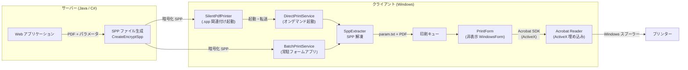
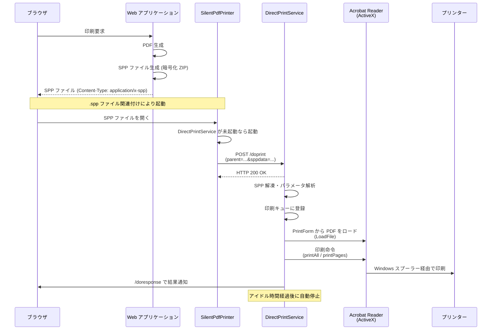
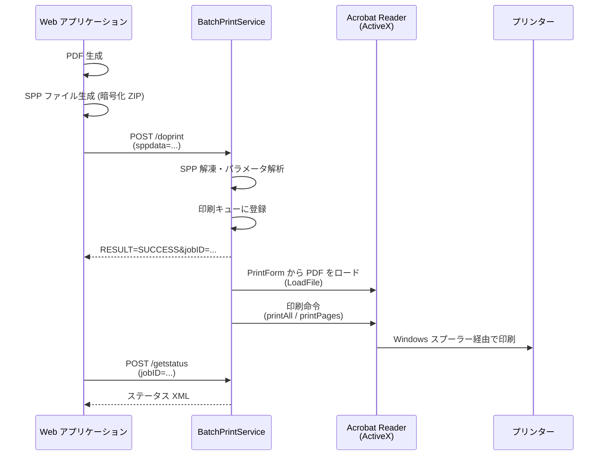
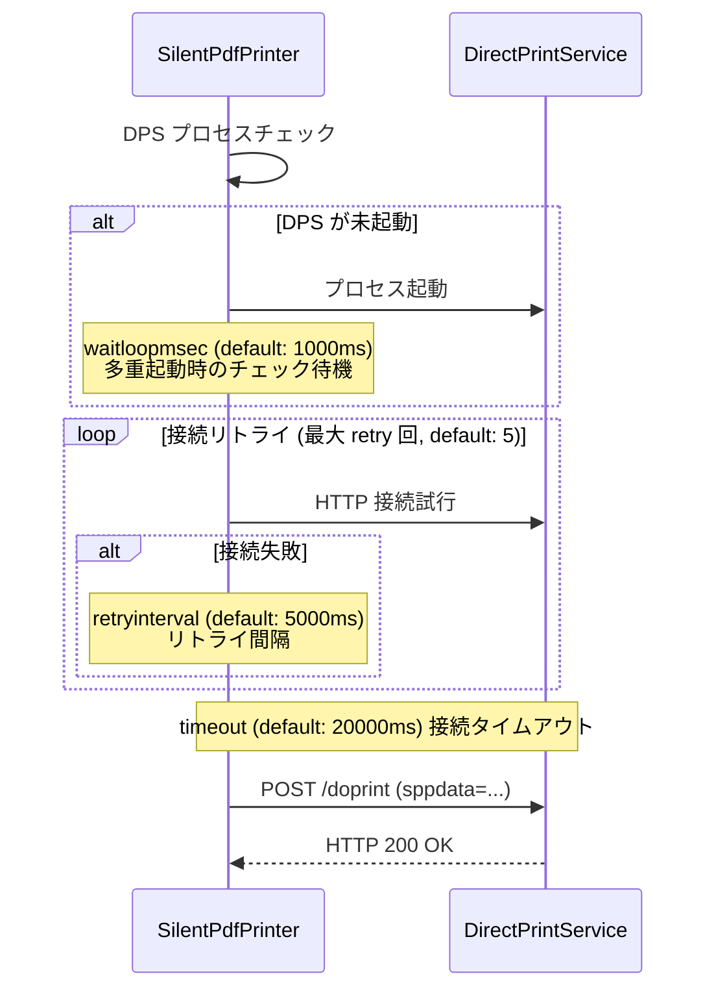
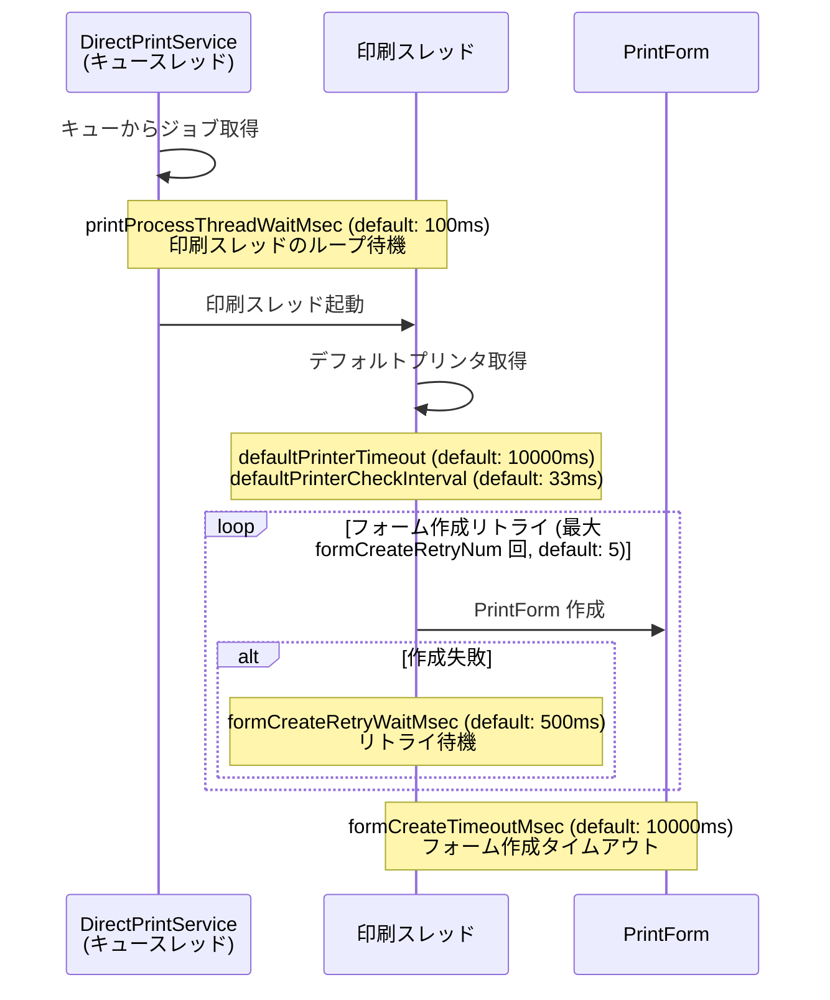
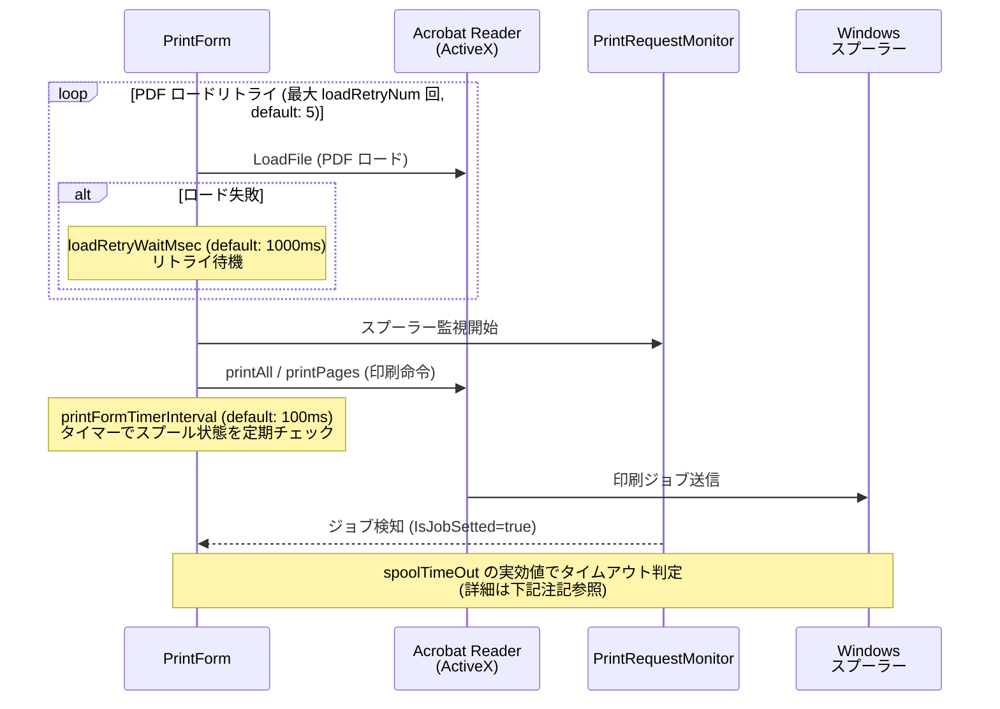
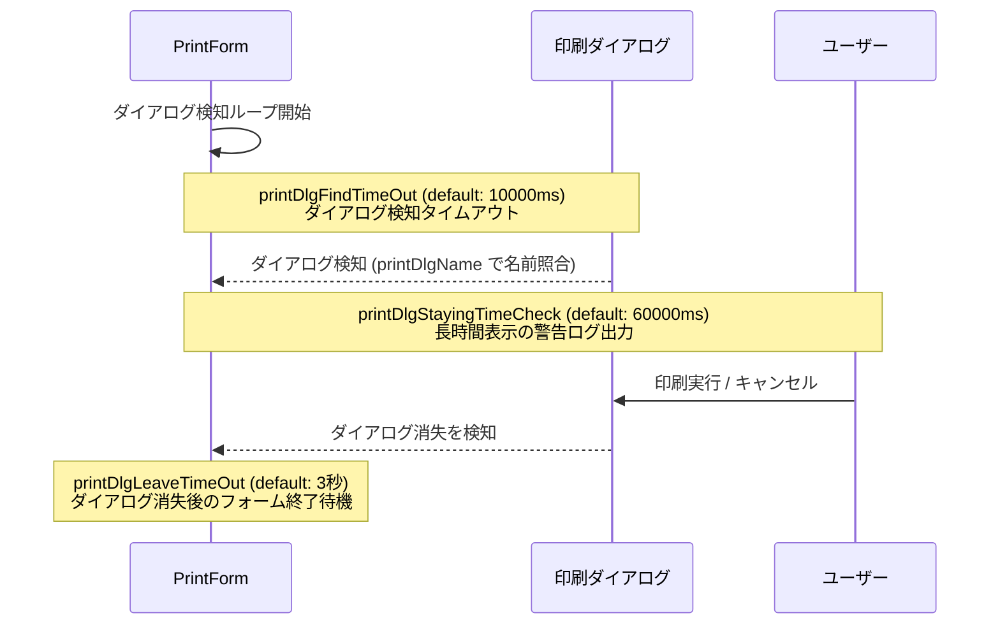
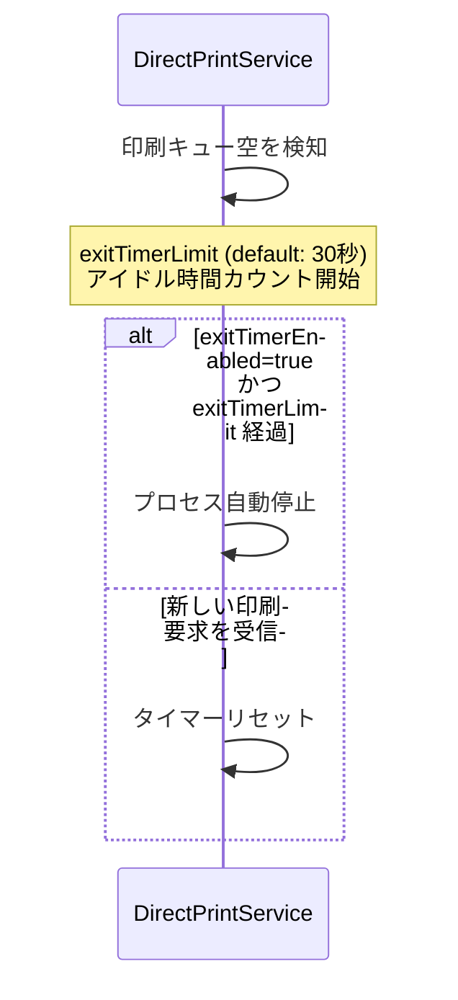
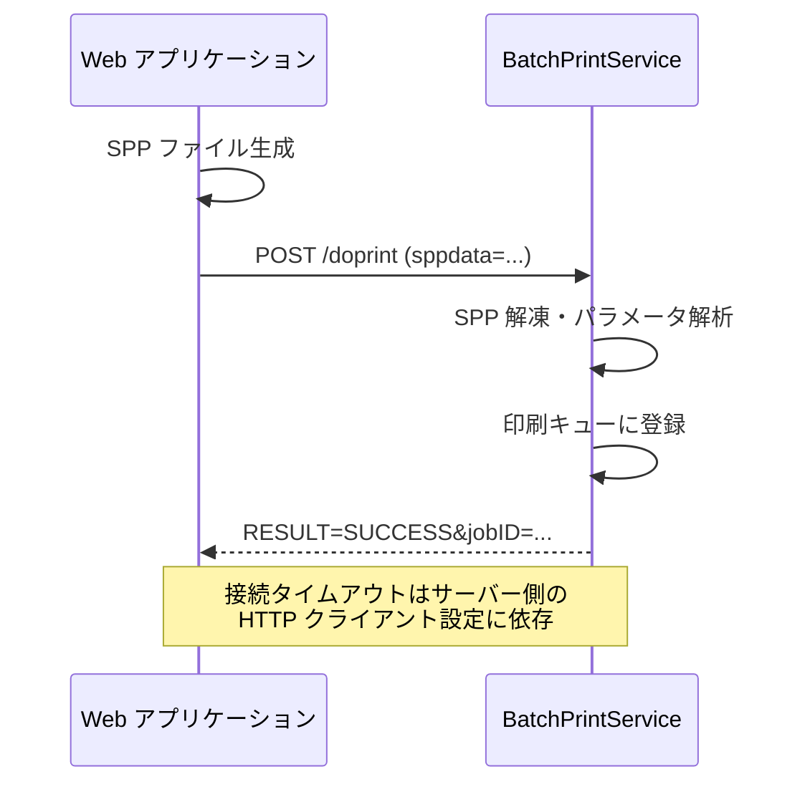
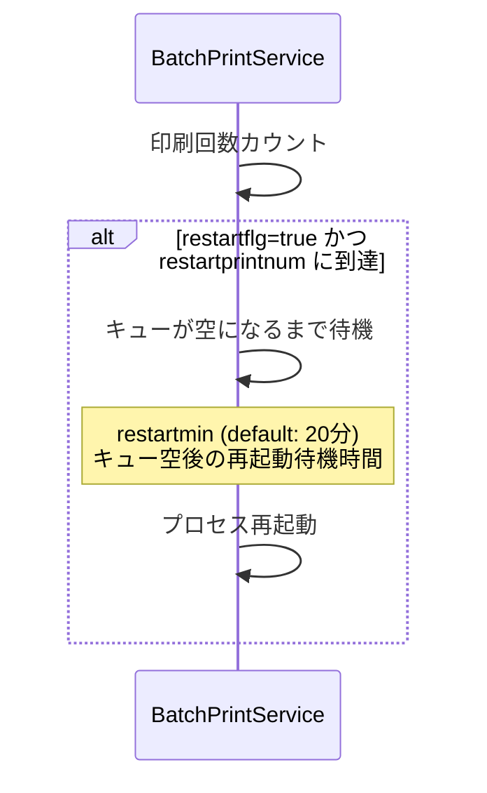

# アーキテクチャ

bizprint のシステムアーキテクチャについて説明します。

## システム全体像

bizprint は、サーバーサイドで生成された印刷データ（SPP ファイル）を、Windows クライアントが受信して印刷を実行するシステムです。

> **注意**: DirectPrintService・BatchPrintService は Windows サービスではありません。
> DirectPrintService はオンデマンド起動型のプロセス、BatchPrintService は常駐型の Windows フォームアプリケーションです。
> いずれも PDF 印刷に Acrobat SDK (ActiveX) 経由で Acrobat Reader を使用しており、デスクトップセッション（ログイン状態）が必要です。

> **前提条件**: クライアント PC には **Adobe Acrobat Reader** があらかじめインストールされている必要があります。
> bizprint-client は Acrobat Reader の ActiveX コントロール（`AxAcroPDFLib`）を利用して PDF の表示・印刷を行うため、
> Acrobat Reader がインストールされていない環境では動作しません。



### ダイレクト印刷

ダイレクト印刷は、ブラウザ経由でリアルタイムに印刷を実行する方式です。



ダイレクト印刷では、サーバーが HTTP レスポンスとして SPP ファイルをブラウザに返却します。ブラウザが SPP ファイルをダウンロードすると、ファイル関連付けにより SilentPdfPrinter が起動します。SilentPdfPrinter は DirectPrintService が起動していなければ起動させ、SPP ファイルを HTTP で転送します。DirectPrintService は一定のアイドル時間が経過すると自動的にプロセスを停止します。印刷結果は `/doresponse` エンドポイント経由でブラウザに通知されます。

### バッチ印刷

バッチ印刷は、サーバーから直接クライアントに印刷データを送信する方式です。BatchPrintService は常駐型の Windows フォームアプリケーションとして動作し、常にユーザーがログインしている必要があります（Acrobat Reader がデスクトップセッションを必要とするため）。



バッチ印刷では、サーバーが直接 BatchPrintService の `/doprint` エンドポイントに SPP ファイルを POST します。レスポンスとして印刷結果（成功/失敗）と jobID が返却されます。印刷状況は `/getstatus` エンドポイントで問い合わせることができます。

## 処理フェーズとタイマー設定（ダイレクト印刷）

ダイレクト印刷の処理は 5 つのフェーズに分かれます。各フェーズのシーケンス図に、関連するタイマー・インターバル設定を示します。設定の詳細は[設定リファレンス](configuration.md)を参照してください。

### フェーズ 1: 接続（SilentPdfPrinter → DirectPrintService）

SilentPdfPrinter が DirectPrintService に SPP ファイルを転送するフェーズです。DirectPrintService が未起動の場合は起動してから接続します。



| 設定項目 | 設定ファイル | デフォルト値 | 説明 |
|---|---|---|---|
| `timeout` | SilentPdfPrinter.xml | 20000ms | 接続タイムアウト |
| `retry` | SilentPdfPrinter.xml | 5 回 | 接続リトライ回数 |
| `retryinterval` | SilentPdfPrinter.xml | 5000ms | リトライ間隔 |
| `waitloopmsec` | SilentPdfPrinter.xml | 1000ms | 多重起動時のチェック待機時間 |

### フェーズ 2: キュー監視・フォーム作成

DirectPrintService が印刷キューからジョブを取り出し、印刷用の PrintForm（非表示 Windows フォーム）を作成するフェーズです。



| 設定項目 | 設定ファイル | デフォルト値 | 説明 |
|---|---|---|---|
| `printProcessThreadWaitMsec` | DirectPrintService.xml | 100ms | 印刷スレッドのループ待機時間 |
| `defaultPrinterTimeout` | DirectPrintService.xml | 10000ms | デフォルトプリンタ取得タイムアウト |
| `defaultPrinterCheckInterval` | DirectPrintService.xml | 33ms | デフォルトプリンタ取得のチェック間隔 |
| `formCreateTimeoutMsec` | DirectPrintService.xml | 10000ms | フォーム作成のタイムアウト |
| `formCreateRetryNum` | DirectPrintService.xml | 5 回 | フォーム作成の最大リトライ回数 |
| `formCreateRetryWaitMsec` | DirectPrintService.xml | 500ms | フォーム作成のリトライ待機時間 |

### フェーズ 3: PDF ロード・印刷実行・スプーラー監視

PrintForm が Acrobat Reader (ActiveX) で PDF をロードし、印刷を実行して、Windows スプーラーへのジョブ送信完了を監視するフェーズです。



| 設定項目 | 設定ファイル | デフォルト値 | 説明 |
|---|---|---|---|
| `loadRetryNum` | DirectPrintService.xml | 5 回 | PDF ロードのリトライ回数 |
| `loadRetryWaitMsec` | DirectPrintService.xml | 1000ms | PDF ロードのリトライ待機時間 |
| `printFormTimerInterval` | DirectPrintService.xml | 100ms | スプール状態チェックのタイマー間隔 |
| `spoolTimeOut` | DirectPrintService.xml | 60000ms | スプーラー監視タイムアウト（設定値） |

> **`spoolTimeOut` の実効値について**
>
> `spoolTimeOut` の設定値には、PDF ロードのリトライに要する時間（`loadRetryNum * loadRetryWaitMsec`）が自動的に加算されます。さらに、タイムアウト判定ではこの実効値の **2 倍**の時間が使用されます。
>
> デフォルト値での計算例:
> 1. 設定値: 60000ms
> 2. ロードリトライ時間の加算: 60000 + (5 * 1000) = 65000ms（実効値）
> 3. タイムアウト判定: 65000 * 2 = **130000ms（130 秒）**
>
> 白紙印刷や印刷タイムアウト（エラーコード 0405, 0410）が発生する場合は、この実効値を考慮して `spoolTimeOut` を調整してください。詳細は[トラブルシューティング](troubleshooting.md#タイマーインターバル設定の調整ガイド)を参照してください。

### フェーズ 4: 印刷ダイアログ監視（printDialog=true の場合のみ）

`printDialog=true` が指定された場合にのみ実行されるフェーズです。Acrobat Reader が表示する印刷ダイアログをウィンドウ名で検知し、ユーザーの操作完了を待機します。



| 設定項目 | 設定ファイル | デフォルト値 | 説明 |
|---|---|---|---|
| `printDlgFindTimeOut` | DirectPrintService.xml | 10000ms | ダイアログ検知タイムアウト |
| `printDlgStayingTimeCheck` | DirectPrintService.xml | 60000ms | ダイアログ長時間表示の警告ログまでの時間 |
| `printDlgLeaveTimeOut` | DirectPrintService.xml | 3 秒 | ダイアログ消失後のフォーム終了待機 |
| `printDlgName` | DirectPrintService.xml | `印刷\|進行状況` | 監視対象ダイアログのウィンドウ名 |

### フェーズ 5: サービス自動停止

DirectPrintService はオンデマンド起動型のため、印刷キューが空になり一定時間アイドル状態が続くと自動的にプロセスを停止します。



| 設定項目 | 設定ファイル | デフォルト値 | 説明 |
|---|---|---|---|
| `exitTimerEnabled` | DirectPrintService.xml | true | 自動停止を有効にするか |
| `exitTimerLimit` | DirectPrintService.xml | 30 秒 | 自動停止までのアイドル時間 |

---

## 処理フェーズとタイマー設定（バッチ印刷）

バッチ印刷はダイレクト印刷と以下の点が異なります:

- **フェーズ 1 が異なる**: SilentPdfPrinter を介さず、サーバーから直接 BatchPrintService に POST する
- **フェーズ 4 がない**: バッチ印刷では `printDialog` パラメータが使用されないため、印刷ダイアログ監視は行われない
- **フェーズ 5 が異なる**: 自動停止ではなく、自動再起動（メモリリーク対策）

フェーズ 2（キュー監視・フォーム作成）とフェーズ 3（PDF ロード・印刷実行・スプーラー監視）はダイレクト印刷と同一です。設定ファイル名が `BatchPrintService.xml` になる点のみ異なります。

### フェーズ 1: 接続（サーバー → BatchPrintService）

サーバーから直接 BatchPrintService に SPP ファイルを POST するフェーズです。SilentPdfPrinter を介さないため、クライアント側のタイマー設定はありません。



### フェーズ 5: サービス自動再起動

BatchPrintService は常駐型アプリケーションのため、自動停止ではなく自動再起動機能を持ちます。長時間稼働時のメモリリーク対策として、一定回数の印刷後にプロセスを再起動します。



| 設定項目 | 設定ファイル | デフォルト値 | 説明 |
|---|---|---|---|
| `restartflg` | BatchPrintService.xml | true | 自動再起動を有効にするか |
| `restartprintnum` | BatchPrintService.xml | 128 回 | 再起動までの印刷回数 |
| `restartmin` | BatchPrintService.xml | 20 分 | キュー空後の再起動待機時間 |

## SPP ファイル仕様

SPP（Silent PDF Print）ファイルは、印刷パラメータと PDF データを暗号化 ZIP でパッケージングしたファイルです。

### 構造

SPP ファイルは以下の 2 ファイルを含む暗号化 ZIP アーカイブです。

| ファイル名 | 内容 |
|---|---|
| `param.txt` | 印刷パラメータ（改行区切りの key=value 形式） |
| `{jobName}.pdf` | 印刷対象の PDF ファイル |

### 暗号化仕様

| 項目 | 値 |
|---|---|
| 圧縮形式 | ZIP (DEFLATE) |
| 圧縮率 | NORMAL |
| 暗号化方式 | AES |
| 鍵長 | 256 bit (AES-256) |
| 文字エンコーディング | UTF-8 |

### パスワード構成

SPP ファイルのパスワードは、以下の 3 つの要素を連結した文字列です。

```
RANDOM_STRING_1 + ユーザーパスワード + RANDOM_STRING_2
```

| 要素 | 説明 |
|---|---|
| `RANDOM_STRING_1` | ビルド時に自動生成されるランダム文字列（前半固定部分） |
| ユーザーパスワード | API 呼び出し時にユーザーが指定する任意のパスワード（省略可能） |
| `RANDOM_STRING_2` | ビルド時に自動生成されるランダム文字列（後半固定部分） |

- ユーザーパスワードが未指定の場合、パスワードは `RANDOM_STRING_1 + RANDOM_STRING_2` となります。
- ユーザーパスワードは平文または Base64 エンコード済みの文字列で指定できます。

### ビルド時のランダム文字列生成

暗号化キー（`RANDOM_STRING_1` / `RANDOM_STRING_2`）は、Maven ビルドの `generate-sources` フェーズで自動生成されます。

1. ルートの `pom.xml` で `maven-antrun-plugin` が Java クラス `RandomStringGenerator` を動的に生成・実行します。
2. `RandomStringGenerator` は `UUID.randomUUID()` を使って以下のランダム文字列を生成します。
   - `randomString1`: 10 文字のランダム文字列
   - `randomString2`: 12 文字のランダム文字列
3. 生成された値は `target/generated-props.properties` に書き出されます。
4. 各サブモジュール（`bizprint-server-java`、`bizprint-server-csharp`、`bizprint-client`）のビルド時に、ソースコード内のプレースホルダ `___RANDOM_STRINGS1___` / `___RANDOM_STRINGS2___` がこの値で置換されます。

サーバーとクライアントで同一のキーが必要なため、一部モジュールのみのビルドは不可です。必ず `mvn clean install` で一括ビルドしてください。

`pom.xml` の `<properties>` セクションで `randomString1` / `randomString2` を明示的に指定することで、ランダム生成を抑制して固定値を使用することも可能です。

## param.txt フォーマット

`param.txt` は改行区切りの `key=value` 形式で、以下のパラメータを含みます。

| パラメータ名 | 説明 | 必須 | デフォルト値 | 対象 |
|---|---|---|---|---|
| `printerName` | 出力先プリンタ名 | いいえ | OS のデフォルトプリンタ | 共通 |
| `numberOfCopy` | 印刷部数（1-999） | いいえ | `1` | 共通 |
| `selectedTray` | 出力トレイ名 | いいえ | `AUTO` | 共通 |
| `jobName` | 印刷ジョブ識別子 | いいえ | `JobName_Default` | 共通 |
| `doFit` | ページサイズに合わせて印刷するか（`true`/`false`） | いいえ | `false` | 共通 |
| `fromPage` | 開始ページ番号 | いいえ | なし（全ページ） | 共通 |
| `toPage` | 終了ページ番号 | いいえ | なし（全ページ） | 共通 |
| `responseURL` | 印刷結果通知先 URL | いいえ | なし | ダイレクト印刷のみ |
| `saveFileName` | PDF ファイル保存先パス | いいえ | なし | ダイレクト印刷のみ |
| `target` | ブラウザターゲットフレーム名 | いいえ | なし | ダイレクト印刷のみ |
| `printDialog` | 印刷ダイアログ表示（`true`/`false`） | いいえ | `false` | ダイレクト印刷のみ |

### param.txt の例

```
printerName=Microsoft Print to PDF
numberOfCopy=2
selectedTray=AUTO
jobName=invoice_2024001
doFit=true
```

### トレイ名一覧

`selectedTray` に指定可能な値は以下の通りです。

| トレイ名 | 説明 |
|---|---|
| `FIRST` / `UPPER` / `ONLYONE` | 上段トレイ |
| `LOWER` | 下段トレイ |
| `MIDDLE` | 中段トレイ |
| `MANUAL` | 手差しトレイ |
| `ENVELOPE` | 封筒トレイ |
| `ENVMANUAL` | 封筒手差しトレイ |
| `AUTO` | 自動選択 |
| `TRACTOR` | トラクターフィーダー |
| `SMALLFMT` | 小型フォーマット |
| `LARGEFMT` | 大型フォーマット |
| `LARGECAPACITY` | 大容量トレイ |
| `CASSETTE` | カセット |
| `FORMSOURCE` | フォームソース |
| `LAST` | 最終トレイ |
| `CUSTOM` | カスタムトレイ（ドライバ固有） |

## 通信プロトコル

クライアント（DirectPrintService / BatchPrintService）は HTTP サーバーとして動作し、以下のエンドポイントを提供します。デフォルトポートは `3000` です。

### エンドポイント一覧

| エンドポイント | メソッド | 説明 | 対象 |
|---|---|---|---|
| `/doprint` | POST | 印刷指示 | 共通 |
| `/getstatus` | POST | 印刷状態取得 | バッチ印刷のみ |
| `/doresponse` | GET | 印刷結果応答 | ダイレクト印刷のみ |
| `/isalive` | GET/POST | 生存確認 | 共通 |

### POST /doprint（印刷指示）

印刷データ（SPP ファイル）を送信して印刷を実行します。

**リクエスト形式:**

- ダイレクト印刷: `parent={ブラウザ情報}&sppdata={SPPバイナリ}`
- バッチ印刷: `sppdata={SPPバイナリ}`

**レスポンス（ダイレクト印刷）:**

```
HTTP/1.1 200 OK
Content-Length: 0
Content-Type: text/html
```

ダイレクト印刷では即座に `200 OK` を返し、印刷結果は後続の `/doresponse` で通知します。

**レスポンス（バッチ印刷）:**

```
HTTP/1.1 200 OK
Content-Type: text/plain
```

レスポンスボディ（URL エンコード済み）:

成功時:
```
RESULT=SUCCESS&ERROR_CODE=000&jobID={発行されたジョブID}
```

失敗時:
```
RESULT=FAIL&ERROR_CODE={エラーコード}&ERROR_CAUSE={エラー原因}&ERROR_DETAILS={エラー詳細}&jobID=
```

### POST /getstatus（印刷状態取得）

バッチ印刷でのみ使用可能です。指定した jobID の印刷状態を問い合わせます。ダイレクト印刷では `404 Not Found` が返されます。

**リクエスト形式:**

```
jobID={ジョブID}
```

複数の jobID を指定する場合は `&` で連結します。jobID を省略した場合は全ジョブの状態が返されます。

**レスポンス:**

```
HTTP/1.1 200 OK
Content-Type: text/xml
```

レスポンスボディ（XML 形式）:

```xml
<?xml version="1.0" encoding="shift_jis"?>
<Response>
  <Result>SUCCESS</Result>
  <ErrorCode>000</ErrorCode>
  <ErrorCause></ErrorCause>
  <ErrorDetails></ErrorDetails>
  <PrintStatus JobId="{ジョブID}">
    <jobName>{ジョブ名}</jobName>
    <printerName>{プリンタ名}</printerName>
    <DateTime>{日時}</DateTime>
    <Status>{ステータス文字列}</Status>
    <StatusCode>{ステータスコード}</StatusCode>
    <ErrorCode>{エラーコード}</ErrorCode>
    <ErrorCause>{エラー原因}</ErrorCause>
    <ErrorDetails>{エラー詳細}</ErrorDetails>
  </PrintStatus>
</Response>
```

**ステータスコード一覧:**

| コード | 日本語 | 英語 | 説明 |
|---|---|---|---|
| `0x00` | 印刷指示受信 | Receive Print Request | 初期状態 |
| `0x02` | 印刷指示受付 | Print Request Acceptance | キュー待ち状態 |
| `0x04` | 印刷中 | Printing in Progress | 印刷処理実行中 |
| `0x06` | 印刷要求送信完了 | Print Request Transmission Complete | 正常完了 |
| `0x08` | 印刷異常終了 | Print Abnormal Termination | エラー終了 |
| `0x10` | 印刷要求送信タイムアウト | Print Request Transmission Timeout | タイムアウト |

### GET /doresponse（印刷結果応答）

ダイレクト印刷でのみ使用可能です。印刷完了後にブラウザへ結果を通知するために使用します。バッチ印刷では `404 Not Found` が返されます。

**リクエスト形式:**

URL パスに `$` 区切りで以下の情報が含まれます。

```
/doresponse${リダイレクト先URL}${パラメータ}${ターゲットフレーム}${ジョブID}
```

パラメータには以下のキーが含まれます。

| キー | 説明 |
|---|---|
| `RESULT` | 結果（`SUCCESS` / `FAIL`） |
| `ERROR_CODE` | エラーコード |
| `ERROR_CAUSE` | エラー原因 |
| `ERROR_DETAILS` | エラー詳細 |

**レスポンス:**

成功時は HTML 形式のリダイレクトページが返されます。データがない場合は `204 No Content` が返されます。

```
HTTP/1.1 200 OK
Content-Type: text/html
Cache-Control: no-store
Connection: close
```

### GET /isalive（生存確認）

クライアントサービスの生存確認を行います。印刷キューの処理が正常に動作しているかを監視します。

**レスポンス:**

正常時:
```
HTTP/1.1 200 OK
Content-Type: text/xml

isalive ok
```

異常時（キュー処理停滞）:
```
HTTP/1.1 500 NG
Content-Type: text/xml

isalive ng
```

判定条件は、最後のキュー処理チェックからの経過時間が設定されたタイムアウト値を超えているかどうかです。印刷ダイアログ表示中は常に正常と判定されます。
